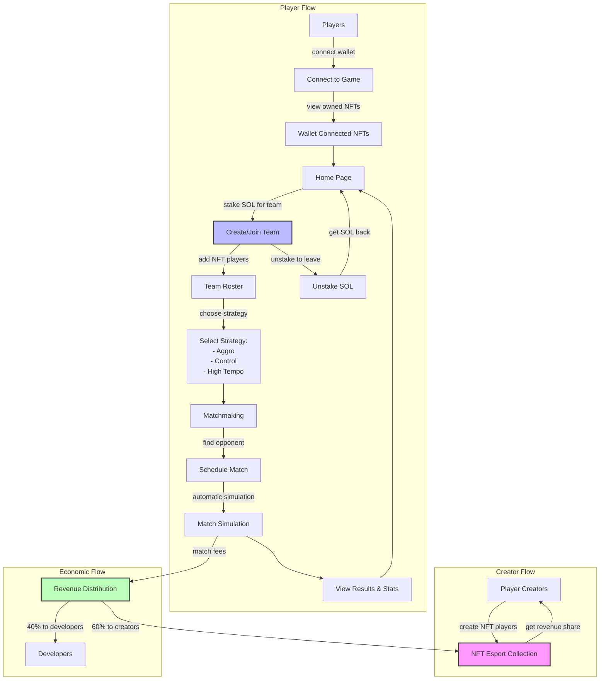

# 5vs5dotGG - ideal flow
## Creator Flow

### NFT Creation

Creators mint programmable NFTs (pNFTs) representing esports players
They define player attributes like position, mechanical skill, game knowledge, etc.
NFTs belong to a collection for the 5VS5dotGG ecosystem

### Revenue Earning

Creators earn 60% of match fees when their NFT players are used in games
Revenue is tracked and distributed automatically through the CreatorRevenue component

## Player Flow

### NFT Acquisition

Players purchase/acquire NFTs representing esport players from creators
These NFTs have specific attributes that affect gameplay

### Team Creation

Players stake SOL (minimum 1 SOL) to create a team
This creates a TeamData component and a TeamStake component in the system
The stake serves as both an economic commitment and anti-spam measure

### Team Management

Players add their owned NFTs to their team roster
Each NFT player is assigned to specific positions (e.g., "Midlaner")
The team can have multiple players in different positions

### Strategy Selection

Players select a team strategy (e.g., "Aggro", "Control", "High Tempo")
Different strategies would likely have different effectiveness based on roster composition

### Match Scheduling

Players can schedule matches against other teams
Matches can be different types (friendly, ranked, etc.)

### Match Simulation

Matches are simulated on-chain based on team composition and strategy
Results are determined algorithmically using player NFT attributes
No actual gameplay occurs - this is a simulation-based system

### Result Review

Players can view match results and statistics
This likely affects team rankings and player performance metrics

### Team Dissolution (Optional)

Players can unstake their SOL to dissolve the team
This returns their staked SOL to their wallet

## Economic Flow

### Match Fee Collection

Each match generates a fee (currently 0.1 SOL per match)
This fee is collected from the players or spectators (not clear from the code)

### Revenue Distribution

60% of match fees go to NFT creators based on NFT usage
40% goes to platform developers
Distribution is handled automatically by the RevenueSystem

