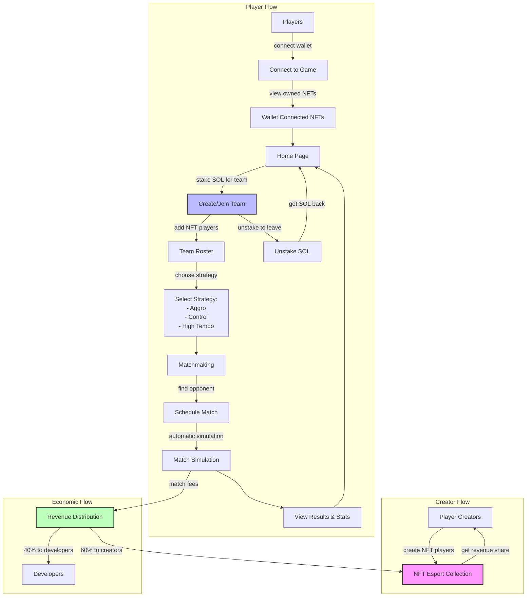

esport - contract

```mermaid
graph TD
    subgraph "Creator Flow"
        C1[Player Creators] -->|create NFT players| Collection[NFT Esport Collection]
        Collection -->|get revenue share| C1
    end

    subgraph "Player Flow"
        P1[Players] -->|connect wallet| Game[Connect to Game]
        Game -->|view owned NFTs| Wallet[Wallet Connected NFTs]
        Wallet --> Home[Home Page]
        
        Home -->|stake SOL for team| Team[Create/Join Team]
        Team -->|add NFT players| Roster[Team Roster]
        Roster -->|choose strategy| Strategy[Select Strategy:<br/>- Aggro<br/>- Control<br/>- High Tempo]
        
        Strategy --> Match[Matchmaking]
        Match -->|find opponent| Schedule[Schedule Match]
        Schedule -->|automatic simulation| Simulation[Match Simulation]
        Simulation --> Results[View Results & Stats]
        Results --> Home
        
        Team -->|unstake to leave| Unstake[Unstake SOL]
        Unstake -->|get SOL back| Home
    end

    subgraph "Economic Flow"
        Simulation -->|match fees| Revenue[Revenue Distribution]
        Revenue -->|60% to creators| Collection
        Revenue -->|40% to developers| Dev[Developers]
    end

    style Collection fill:#f9f,stroke:#333,stroke-width:2px
    style Team fill:#bbf,stroke:#333,stroke-width:2px
    style Revenue fill:#bfb,stroke:#333,stroke-width:2px
```